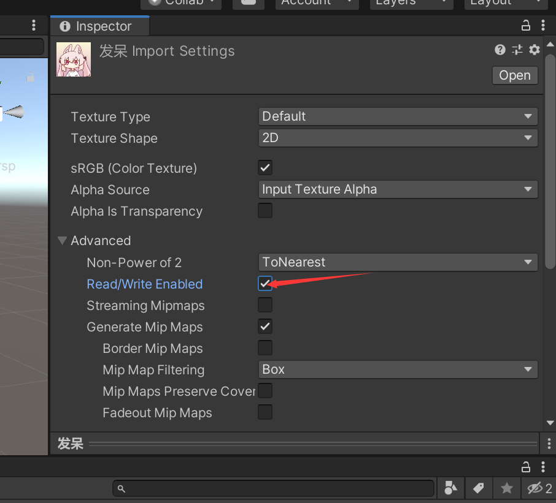
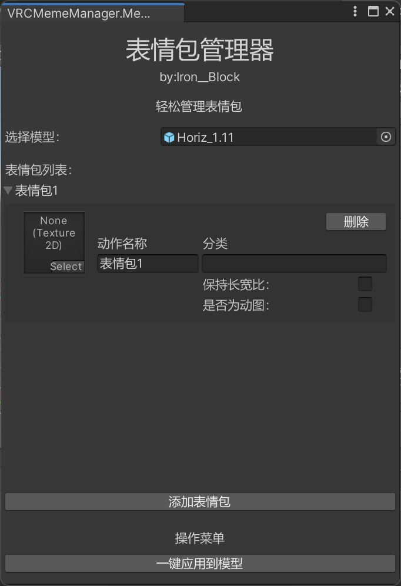

# VRChat 表情包管理器

VRChat 表情包管理器是一个为VRChat开发者设计的工具，允许你为VRChat模型添加表情包，包括动态图和静态图片。这个工具让你可以更轻松地定制和丰富你的VRChat模型的表现力，让你的模型在VRChat世界中更加生动和有趣。

## 功能特性

- 一键添加静态图片表情包：支持各种静态图片格式（例如：PNG，JPG等）的表情包。
- 一键添加动态表情包：支持动图格式（例如：GIF）的动态表情包。

## 安装
1. 下载本插件的UnityPackage([从Github上下载](https://github.com/ASimpleIronBlock/VRChatMemeManager/releases)或者在[Booth上下载]())
2. 导入下载的UnityPackage

## 使用说明
1. 导入你要添加的表情包图片, 静态图片可以使用jpg和png格式, 动态图片请使用gif格式, 然后在导入的图片的导入设置中勾选Read/Write Enabled

2. 导入后可以在菜单栏上看见一个新的菜单: 表情包管理器, 点开它在点击主面板.

3. 主面板打开后, 将你的模型拖到指定的位置

4. 如果你拖入的表情包是个动图, 勾选"是否为动图", 在勾选后输入动图的帧率
5. 如果你的表情包不是正方形的, 勾选保持长宽比, 它可以使你的表情包保持原来的比例

## 贡献
如果你在使用中发现了什么问题或者有什么建议, 可以提一个Issue. 如果你能提一个Pull Request那就更好了~

## 使用了的开源项目
十分感谢下面的开源项目~

[如梦工具箱](https://gitee.com/cmoyuer/vrchat-avatar-toolkit/tree/v2.0)[(Apache-2.0协议)](https://gitee.com/cmoyuer/vrchat-avatar-toolkit/blob/v2.0/LICENSE)

[ThryEditor](https://github.com/Thryrallo/ThryEditor)[(MIT协议)](https://github.com/Thryrallo/ThryEditor/blob/master/LICENSE)

